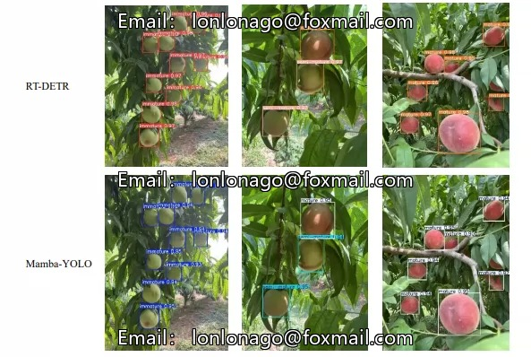
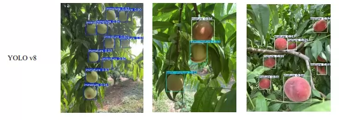
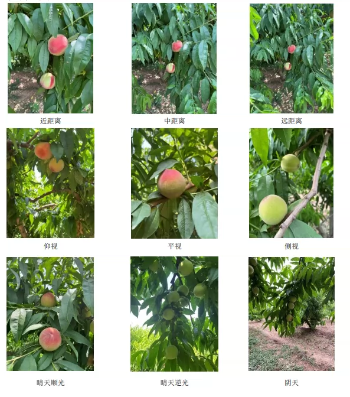
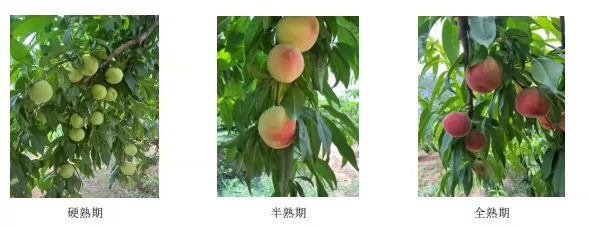
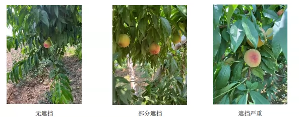
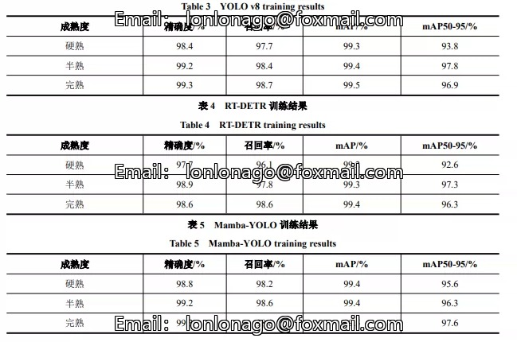
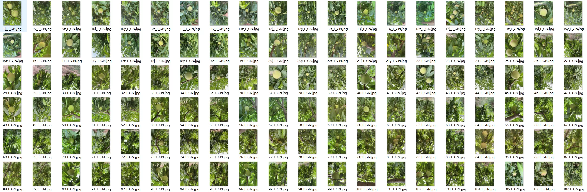

## Body

（Agricultural Product）Facing the Different Maturity Stages of Melons in a Smart Orchard Image Dataset for YOLO VOC

Field photography period: May 27, 2024 - June 21, 2024
Geographical coordinates of the collection location: 36°1′8″N, 114°45′56″E

Annotation categories (3 types of maturity, all with fruit boundary box annotations)
1. Immature (green): The fruit skin is entirely green, without any red halo, and the area of red coloring is less than 30%
2. Half-mature (semimature): The fruit skin has red / orange red coloring between 30% and 70%, with a blurred red halo boundary
3. Mature (ripe): The red coloring area is more than 70%, and the fruit is extensively red

Original collection images: High-definition original images total: 1245; Immature: 408; Half-mature: 399; Mature: 438; Total number of manually labeled fruit boundary boxes: 3493; Immature tags: 1618; Half-mature tags: 707; Mature tags: 1168.
Original file size: 8.23 GB

Complete dataset with data augmentation: Total image quantity in the dataset: 11595; Seven kinds of augmentation per image, at least one kind of augmentation method per image
Augmented file size: 15.56 GB

Total dataset capacity: 23.79 GB

Image files: JPG format, resolution 3024 × 4032
Annotation files:
- Pascal VOC standard: .xml format
- YOLO training specific: .txt format

Contain author's source article

Electronic virtual products are not returnable upon sale.

## Images

Here is a pay link on Stripe ( https://buy.stripe.com/3cs8yP7sY87d0vu9AB ). Please contact me lonlonago@foxmail.com after funding $89, and I will send you a complete data files , thank you!

